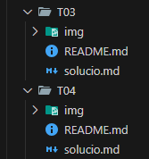

# GitHub personal  
## Pau Guerrero Bossy

---

## 1. Presentació personal

Hola, soc **Pau Guerrero Bossy** i tinc **17 anys**.

Actualment estic estudiant **SMX (Sistemes Microinformàtics i Xarxes)**.

En aquesta defensa presentaré el meu perfil de **GitHub**, on es poden trobar tots els projectes que he realitzat durant aquest curs. Aquests projectes mostren la meva evolució, els coneixements adquirits i la manera com he anat millorant en l’ús d’eines professionals com **GitHub**, **Visual Studio Code** i la documentació amb **Markdown**.

### Enllaç principal

- [Perfil de GitHub](https://github.com/Pau-Guerrero)
- [README personal](https://github.com/Pau-Guerrero)

---

<br>
<br>
<br>
<br>

## 2. Repositoris de GitHub

En aquest apartat es mostren els diferents projectes realitzats durant el curs, amb una breu explicació de cadascun i els seus enllaços corresponents.

---

### Projecte 1 — Introducció al treball professional

Aquest projecte va sobre aprendre a treballar com en una empresa real des del primer moment.

No se centra en crear un producte final, sinó en desenvolupar una bona organització, planificació i treball en equip utilitzant metodologies com **Kanban**.

El mòdul de Projecte Intermodular actua com a client, fent seguiment, supervisant i avaluant que es compleixi la metodologia.

L’objectiu principal és adquirir hàbits professionals i saber col·laborar correctament amb altres persones en un entorn de treball.

**Enllaç:**

- [Projecte 1](https://github.com/Pau-Guerrero/PROJECTE1)

---

### Projecte 2 — EverPia: consultoria IT

Aquest projecte va sobre posar-se en el paper d’un consultor júnior dins d’una empresa fictícia anomenada **EverPia**.

L’objectiu és aprendre a adaptar-se a diferents clients i reptes tecnològics, treballant amb organització i visió global.

Es treballa amb metodologia **Kanban** i eines com **Planner**, donant molta importància a la planificació, documentació i treball en equip.

El que es busca és desenvolupar competències tècniques i professionals, simulant situacions reals d’una consultora IT.

**Enllaços:**

- [Projecte demo 2](https://github.com/Pau-Guerrero/projecte2demo)
- [Projecte 2](https://github.com/Pau-Guerrero/Projecte2)

---

<br>
<br>
<br>
<br>


### Projecte 3 — EverPia 2: supervivència IT

Aquest projecte va sobre continuar l’experiència d’EverPia, però centrant-se en mantenir i gestionar una infraestructura IT real en situacions de pressió.

L’objectiu és aprendre a resoldre incidències, administrar serveis i treballar amb metodologia àgil en un entorn més exigent.

Es posa èmfasi en la supervivència dins una empresa IT: gestionar problemes, documentar-los i treballar en equip sota estrès.

El que es busca és consolidar coneixements tècnics i desenvolupar habilitats professionals per afrontar situacions reals del món laboral.

**Enllaç:**

- [Projecte 3](https://github.com/Pau-Guerrero/Projecte3)

---

### Projecte 4 — EverPia 3: carpeta professional

Aquest projecte va sobre el tancament de l’etapa a EverPia, on l’alumne ja actua amb més autonomia i mentalitat professional.

L’objectiu és demostrar tots els coneixements adquirits, integrant tècnica, organització i capacitat de resolució de problemes reals.

Es treballen tasques avançades com desplegar serveis, fer backups, utilitzar Git, dissenyar prototips i documentar tot el procés amb metodologia Kanban.

El resultat final és una carpeta professional amb tots els projectes, que serveix com a prova del nivell assolit i preparació per al món laboral IT.

**Enllaç:**

- [Projecte 4](https://github.com/Pau-Guerrero/PROJECTE-4)

---

### Projecte 5 — Incubadora d’empresa IT

Aquest projecte va sobre crear i desenvolupar una empresa IT des de zero dins d’una incubadora simulada.

L’objectiu és aplicar tot el que s’ha après fins ara per resoldre un problema real, definint un client, una solució i un model de negoci viable.

També es treballa el perfil professional propi, reflexionant sobre el valor, les habilitats i el futur laboral de cada alumne.

El resultat final és un **pitch tipus Shark Tank**, on s’ha de defensar l’empresa i demostrar capacitat real com a professional.

**Enllaç:**

- [Projecte 5](https://github.com/Pau-Guerrero/projecte5-Pau-Guerrero)

---

### Projecte 6 — Projecte Nexus

Aquest projecte va sobre dissenyar i desplegar una plataforma **E-learning** sobre un servidor eficient i sostenible.

L’objectiu és aprendre a analitzar necessitats, comparar tecnologies com **Nginx** i **Apache**, i escollir la millor solució amb criteri professional.

També es treballa la viabilitat del projecte, incloent costos, manteniment i planificació de la feina.

El resultat final és presentar una proposta completa i justificada, com ho faria un tècnic davant d’un client real.

**Enllaç:**

- [Projecte 6](https://github.com/Pau-Guerrero/projecte6-Pau-Guerrero)

---

### Projecte 7 — FoodLogístic S.A.

Aquest projecte va sobre treballar com una empresa IT real donant resposta a les necessitats d’un client en creixement.

L’objectiu és dissenyar solucions d’infraestructura, comunicació al núvol, seguretat i presència web de manera professional.

També es treballa la planificació, pressupostos i justificació de costos i temps d’implantació.

El resultat final és presentar una proposta tècnica completa i defensar-la davant del client amb criteri i claredat.

**Enllaços:**

- [Projecte 7](https://github.com/Pau-Guerrero/projecte-7-Pau-Guerrero-1)
- [Projecte Web 7](https://github.com/Pau-Guerrero/web-projecte7-Pau-Guerrero)

---

### Projecte 8 — Connecta’t al Futur

Aquest projecte va sobre actuar com a consultors tecnològics ajudant petites i mitjanes empreses a digitalitzar-se.

L’objectiu és analitzar necessitats reals i dissenyar solucions tecnològiques que millorin l’eficiència, seguretat i competitivitat dels negocis.

També es treballa la sostenibilitat, aplicant els **Objectius de Desenvolupament Sostenible** a les propostes tecnològiques.

El resultat final és crear solucions completes i assessoraments professionals basats en situacions reals del món laboral.

**Enllaços:**

- [Projecte PRE 8](https://github.com/Pau-Guerrero/Projecte_PRE8)
- [Projecte 8](https://github.com/Pau-Guerrero/projecte-8-Pau-Guerrero)

---

<br>
<br>
<br>
<br>


## 3. Documentació rellevant

En aquest apartat es destaquen alguns dels documents i productes més importants realitzats durant el curs.

### Projecte 8

### Projecte 7

- [Pàgina web Projecte 7](https://github.com/Pau-Guerrero/web-projecte7-Pau-Guerrero)
- [Memòria tècnica Projecte 7 (P01)](https://github.com/Pau-Guerrero/projecte-7-Pau-Guerrero-1/tree/main/P01)

### Projecte 6

- [Presentació Nexus Projecte 6 (P02)](https://github.com/Pau-Guerrero/projecte6-Pau-Guerrero/tree/main/P02)

### Projecte 5

- [Presentació Projecte 5 (P03)](https://github.com/Pau-Guerrero/projecte5-Pau-Guerrero/tree/main/P03)

### Projecte 4

### Projecte 3

### Projecte 2

### Projecte 1

- [Kanban (P01)](https://github.com/Pau-Guerrero/PROJECTE1/tree/main/P01)
- [Simualcio (P02)](https://github.com/Pau-Guerrero/PROJECTE1/tree/main/P02)
- [Presentació seguretat (P03)](https://github.com/Pau-Guerrero/PROJECTE1/tree/main/P03)

---

<br>
<br>
<br>
<br>


## 4. Organització del treball

### Divisió de tasques

La meva organització es basa principalment en seguir el ritme de cada assignatura. Quan toca una assignatura concreta, treballo directament en les seves tasques i intento avançar el màxim possible.

Si ja he acabat la feina prevista, aprofito aquell temps per revisar, millorar o avançar altres tasques relacionades.

Tot i que no utilitzo una eina externa de planificació de manera habitual, quan tinc alguna entrega important o alguna tasca pendent, faig servir els recordatoris del mòbil per no oblidar-me’n.

---

### Ús de GitHub i Visual Studio Code

Treballo directament des de **Visual Studio Code** connectat amb **GitHub**. Des d’allà creo, modifico i organitzo els fitxers dels projectes.

Per pujar els canvis als repositoris utilitzo comandes bàsiques de Git:

```bash
git add .
git commit -m "Conclusions Tasca03"
git push
```

Aquest sistema em permet tenir un control més clar dels canvis i mantenir els projectes actualitzats.

***

### Organització dels repositoris

No utilitzo eines com Kanban o Trello de manera habitual. La meva organització es basa en seguir el ritme de les classes i completar les tasques dins del temps de cada assignatura.

Tot i així, mantinc una estructura clara dins dels repositoris, separant cada tasca en carpetes independents.

Exemple d’estructura:

```bash
T03/
 ├── img/
 ├── solucio.md
 └── README.md
```

Aquesta estructura em permet tenir cada activitat ordenada, fàcil de revisar i ben documentada.



###### Captura extreta del Projecte 7

***

### Seguiment del projecte

El seguiment dels projectes el faig a través del meu propi treball i dels commits a GitHub. D’aquesta manera es pot veure l’evolució de cada projecte i els canvis que s’han anat fent.

Els commits també serveixen com a registre del progrés, ja que mostren quan s’han afegit o modificat fitxers.

***

<br>
<br>
<br>
<br>


## 5. Problemes i aprenentatge

### Dificultats trobades

Al principi vaig tenir bastants dificultats, sobretot amb **GitHub**, ja que era una eina nova per a mi. No entenia gaire bé com funcionava i em costava organitzar els repositoris.

També vaig tenir errors a l’hora d’entregar tasques, perquè no sempre sabia com estructurar correctament els fitxers o com pujar-los al lloc adequat.

Més endavant, quan vaig començar a utilitzar **Visual Studio Code** connectat amb GitHub, també em va costar bastant. Vaig tenir problemes per clonar repositoris, configurar el meu usuari i correu electrònic, i en alguns casos em sortien repositoris duplicats.

A més, al principi també tenia problemes amb els commits, ja que en pujar els canvis des de Visual Studio Code sovint em donava errors.

***

### Solucions aplicades

Amb el temps, practicant i utilitzant GitHub de manera constant, vaig anar entenent millor el seu funcionament.

Vaig aprendre a utilitzar la terminal per fer els commits i pujar els canvis, cosa que em va donar més control i em va ajudar a evitar errors.

També vaig aprendre a clonar correctament els repositoris i a configurar bé el meu usuari i correu electrònic.

Aquest procés m’ha ajudat a treballar amb més seguretat i autonomia.

***

### Què he après

Gràcies a aquesta experiència he après a utilitzar **GitHub** de manera correcta i a treballar amb repositoris sense errors importants.

També he après a utilitzar **Visual Studio Code** de forma més eficient i a integrar-lo amb GitHub.

A partir del projecte 6 ja em vaig acostumar completament a aquesta manera de treballar, i actualment puc gestionar els meus projectes de forma ordenada, segura i més professional.

***

<br>
<br>
<br>
<br>


## 6. Conclusions finals

En conclusió, aquest recorregut m’ha permès veure tot el meu progrés durant el curs.

Al principi tenia moltes dificultats, sobretot amb GitHub i la gestió dels repositoris, però a mesura que he anat treballant i practicant, he aconseguit entendre millor el funcionament d’aquestes eines.

Crec que el meu GitHub reflecteix aquesta evolució, ja que es pot veure com la meva manera de treballar ha anat millorant amb el temps, tant en l’organització com en l’ús d’eines com Visual Studio Code, Git i Markdown.

Actualment em veig capaç de gestionar projectes, organitzar tasques i treballar sense errors importants. A més, he après a solucionar problemes pel meu compte i a adaptar-me a situacions noves.

Com a millora futura, podria començar a utilitzar eines de planificació més avançades com Kanban, Trello o Planner, per tenir un seguiment encara més professional de les tasques.

En general, aquesta experiència m’ha ajudat a adquirir coneixements importants que podré aplicar en futurs projectes i en el món laboral.

***

<br>
<br>
<br>
<br>


## 7. Resum final

Durant aquest curs he treballat en diferents projectes relacionats amb sistemes, xarxes, serveis, web, consultoria IT, sostenibilitat i digitalització.

A través d’aquests projectes he après a:

* Utilitzar GitHub i Visual Studio Code.
* Documentar projectes amb Markdown.
* Organitzar repositoris correctament.
* Treballar amb serveis i infraestructures IT.
* Comparar tecnologies i justificar decisions.
* Preparar propostes tècniques per a clients.
* Millorar la meva autonomia i capacitat de resolució de problemes.

Aquest GitHub és una mostra del meu aprenentatge i de la meva evolució durant el curs.

